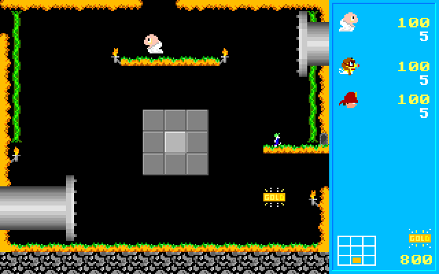

# Pacwars decompilation

This is a decompilation of the MS-DOS Shareware networking game Pacwars.

The main version of the game that is available online is version 1.5. This required Novell Netware 2.5 and is quite hard
to get running now. I've previously created a TSR driver to get that version running with Stock DosBox IPX. 
[Pacwars IPX Driver](https://github.com/yuv422/pacwars_ipx_driver)

I have recently discovered a newer version of the game on discmaster,
[Pacwars version 1.6](https://discmaster.textfiles.com/browse/20300/RoseWare%20-%20Network%20Support%20Library.iso/games/pacbet.zip)

This version contains Debug Symbols!!! Using these
and a combination of Ghidra and AI, I was able to decompile the game back to C. This is buildable in MS-DOS with
Borland C++ 3.x (The original compiler used to write the game)

## Build Instructions

You should be able to run Borland `make` to build the game. `PACWARS.EXE` will be created in the `BUILD` directory.

There is a `compile.sh` script that will launch `dosbox-x` and compile the game. You need to have a copy of Borland C++ 3.x
in a folder called `BORLANDC/` in the root of the repository.

## Running the Game

`PACWARS.EXE` will be copied into the `GAME/` directory. You can run the game from there using dosbox.

There are two scripts that can be used to setup the game with IPX configured. 

* `run.sh` - This will start dosbox as an IPX server and run the game
* `run-client.sh` - This will start dosbox configured as an IPX client and run the game